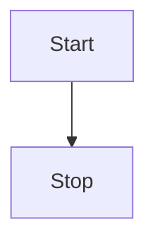
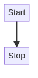
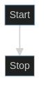

- [Mermaid JS](https://mermaid.js.org/)
- [Starlight Discussion](https://github.com/withastro/starlight/discussions/1259#discussioncomment-8515492)

:::note
Support provided by [astro-mermaid](https://github.com/joesaby/astro-mermaid). 🙇 Thank you [joesaby](https://github.com/joesaby)!
:::



````text title="Code:"

````

#### Pre-generated Images

- [mermaid-cli](https://github.com/mermaid-js/mermaid-cli)

##### Default

```shell title="terminal"
mmdc -i basic.mmdc -o basic.png
```



```shell title="terminal"
mmdc -i basic.mmdc -o basic.svg
```



##### Dark Mode (`-t dark`) & Transparent Background (`-b transparent`)

```shell title="terminal"
mmdc -t dark -b transparent -i basic.mmdc -o basic.png
```



```shell title="terminal"
mmdc -t dark -b transparent -i basic.mmdc -o basic.svg
```


